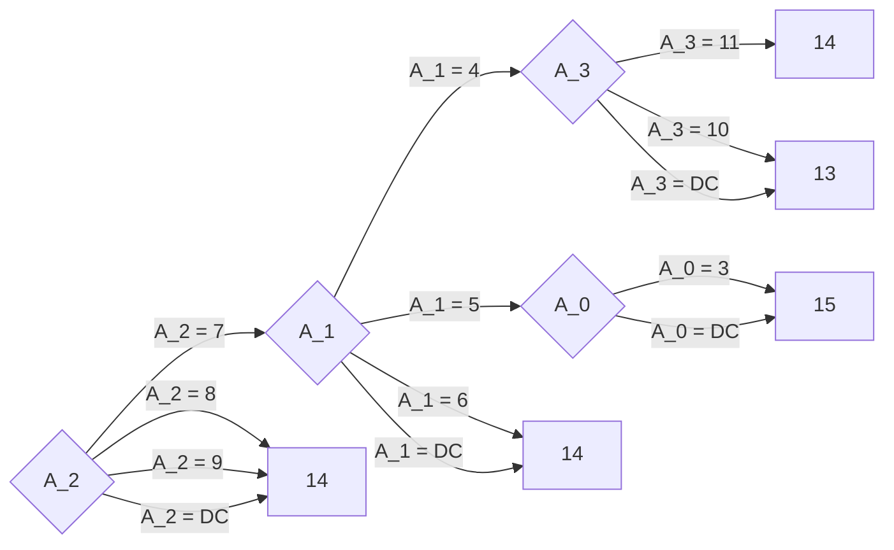

# DecisionTreeInduction

This repository is aimed at the grouping and explaining of rule based tree induction algorithms.

- [DecisionTreeInduction](#decisiontreeinduction)
  - [Explaining the RBDT-1 algorithm](#explaining-the-rbdt-1-algorithm)

## Explaining the RBDT-1 algorithm

